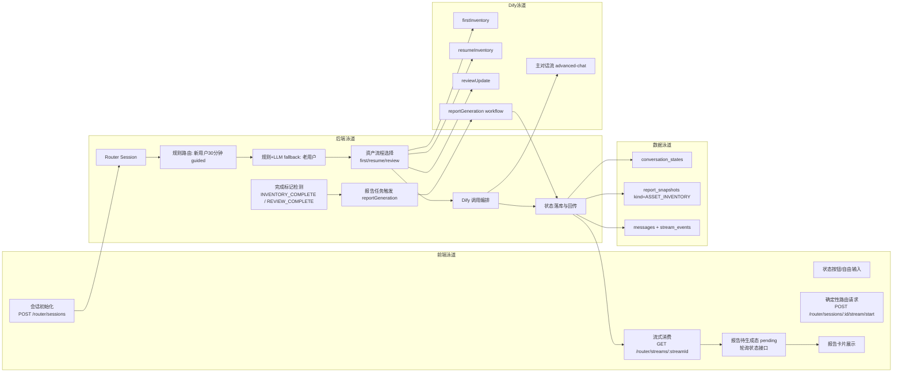

# 一树OPC 架构设计 v2（前后端补全 + Dify 预留接口）

更新时间：2026-04-13

## 1. 设计原则

- 路由决策外置：由前端状态层 + 后端 Router API 决策，不放在 Dify chatflow 内部。
- Dify 只负责内容生成：接收 `query + inputs`，返回文本/变量，不做角色与流程路由判断。
- 会话真相源在后端：`conversation_states + report_snapshots` 统一管理流程状态。
- 前端只消费状态：按钮发送 `routeAction`，不做意图猜测。

## 2. 四泳道主链路（首次/续盘/复盘 + 异步报告）



## 3. 前端泳道细化（固定 6 节点）

1. 会话初始化：创建或恢复 Router Session，拿到 `sessionId/agentKey/routeMode/chatflowId/quickReplies`。
2. 状态按钮/自由输入：按钮带 `quickReplyId + routeAction`，文本走 `inputType=text`。
3. 确定性路由请求：统一调用 `POST /router/sessions/:id/stream/start`。
4. 流式消费：按 `meta/token/card/done/error` 事件渲染消息。
5. 报告待生成态：当 `assetReportStatus=pending` 时轮询 `GET /router/sessions/:id/asset-report/status`。
6. 报告卡片展示：`ready` 后展示 `asset_report` 卡片；`failed` 展示失败提示+重试入口。

## 4. 后端泳道细化（固定 8 节点）

1. Router Session：会话恢复/创建。
2. 规则路由（新用户 30 分钟）：强规则，不走意图识别。
3. 老用户路由：先规则，未命中再 LLM fallback。
4. 资产流程选择：
   - 新用户：`firstInventory`
   - 上次未完成：`resumeInventory`
   - 已有报告且触发复盘：`reviewUpdate`
5. Dify 调用编排：只传 `query + conversation_id + inputs + user`。
6. 完成标记检测：识别 `INVENTORY_COMPLETE` / `REVIEW_COMPLETE`（内部标记，不向前端直出）。
7. 报告任务触发：异步调用 `reportGeneration`，先置 `reportStatus=pending`。
8. 状态落库与回传：更新 `conversation_states/report_snapshots/messages/stream_events`。

## 5. Dify 预留接口（字段固定）

### 5.1 主对话/模块对话

- 入参：`query`, `conversation_id`, `inputs`, `user`

### 5.2 资产四流

- `firstInventory`：`intake_summary`
- `resumeInventory`：`prev_stage`, `prev_profile_snapshot`, `prev_dimension_reports`, `prev_next_question`
- `reviewUpdate`：`old_profile_snapshot`, `old_dimension_reports`, `last_report_date`, `review_version`
- `reportGeneration`：`profile_snapshot`, `dimension_reports`, `report_brief`, `change_summary`, `report_version`, `is_review`

## 6. Router API 契约（当前实现）

- `POST /router/sessions`
- `POST /router/sessions/:id/stream/start`
- `GET /router/streams/:streamId`
- `GET /router/sessions/:id`
- `POST /router/sessions/:id/agent-switch`
- `POST /router/sessions/:id/quick-reply`
- `POST /router/sessions/:id/memory/inject-preview`
- `GET /router/sessions/:id/asset-report/status`（新增）

`asset-report/status` 响应固定：

```json
{
  "assetWorkflowKey": "firstInventory",
  "inventoryStage": "ability",
  "reportStatus": "idle",
  "reportVersion": "1",
  "lastReportAt": "2026-04-13T10:00:00.000Z",
  "lastError": ""
}
```

## 7. routeAction 与流程图按钮映射

- 在上班/没想法 -> `route_explore`
- 有想法/开始尝试 -> `route_scale`
- 已全职在做 -> `route_scale`
- 薅羊毛/政策导向 -> `route_park`
- 好的，开始盘点 -> `asset_radar`
- 我想更新盘点 -> `trigger_review`

## 8. 异常分支

- Dify 超时/不可用：返回可恢复提示，保留会话上下文，不中断主链路。
- 报告工作流失败：`reportStatus=failed`，写入 `lastError`，前端可重试。
- 网络抖动：流式轮询与状态轮询都允许重试，按 `sessionId` 幂等恢复。

## 9. 验收清单

1. 新用户：首次分流 -> `firstInventory` -> 报告卡出现。
2. 断点续盘：中断重进 -> `resumeInventory`，不重复问已确认信息。
3. 复盘更新：已生成报告用户 -> `reviewUpdate` -> 新版本报告。
4. 按钮路由：全部走确定性 `routeAction`，无前端意图猜测。
5. 自由输入兜底：规则未命中可 fallback，不中断会话。
6. 异步报告：`pending -> ready/failed` 转换可观测。
7. 字段契约：四类 Dify 输入字段名与 Router 状态字段稳定无漂移。
